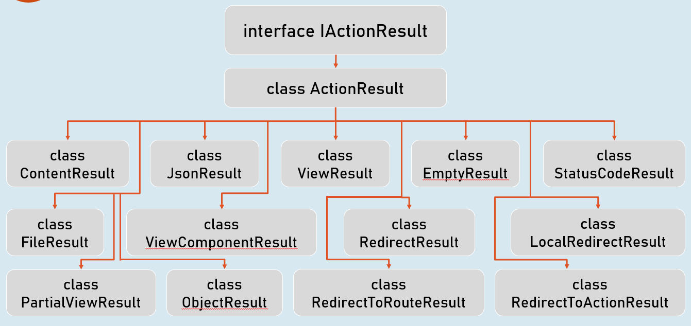
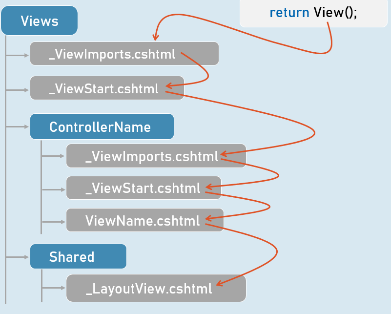

# Notes

## Intro - Overview

* Asp.Net Core FOSS
* 2002 - (Webforms - Event driven - No Cloud support)
* 2006 - (Asp.Net Mvc - MVC - Partial Cloud support)
* 2016 - (Asp.Net Core - MVC - Fully Cloud support)
* Cross platform (i.e Windows/Linux/Mac) after Asp.Net Core V6
* Cross platform server Kestrel by default
* Can use extra server (reverse proxy) on the gateway for production
  * i.e REQ -> (PROXY SERVER) -> (Kestrel) -> Application
  * Proxy server examples - IIS / Nginx/ Apache
    * Note: IIS Express (Light weight version of IIS) & IIS are only supported on windows
* JSON configuration file for server
  * launchSettings.json
  * Contains configuration for different (profiles) server
    * profiles
      * IIS or Project (Kestrel)
      * env variables, port, http/https

## Middleware

Bunch of functions to help with application request

We can can chain number of middleware functions on .Net WebApplication

Takes in `req` Obj & `next` Function in the chain to run

Type of Extension avaialble&#x20;

* `app.Use()-`Can pass req to next middleware or short cirut it
* `app.Run` - Doesn't foward req
* `app.UseWhen` - Branching middleware using conditional logic
* `app.UseMiddleWare<T>()` - Use Class instead of lamda

## Routing

.Net Core provides routing capability out of the box ([https://learn.microsoft.com/en-us/aspnet/core/fundamentals/routing?view=aspnetcore-8.0](https://learn.microsoft.com/en-us/aspnet/core/fundamentals/routing?view=aspnetcore-8.0))

`UseRouting()`&#x20;

* &#x20;Middleware to enable routing
* Point in middleware where  routing desion are made and an Endpoint is associated with a Req

`UseEndPoints()`

* Executes appropriate endpoint created on routing middleware
* We can define out endpoint to map a specific path and req type
* `app.UseEndPoints(e => e.Map('/abc',(ctx) => {..})`&#x20;
* Can use contrainst on Url itself or Define custom Contraint Class (IRouteContraint) with logic and add it to Routing Service

&#x20;`UseStaticFiles()` - Map/Configure static files

## MVC (Model, View, Controller)

<figure><figcaption></figcaption></figure>

MVC is a common design pattern that can be used in different small to large project. This pattern helps in separating software domain/concerns/responsibilities into 3 different group.

* Model - Represents how business data are modelled & handlled
* View - how the things are displayed
* Controller - Controls models & what view are dispalyed

With .Net Core MVC framework, we can easily implement MVC pattern in .Net Projects.

<figure><figcaption></figcaption></figure>

## Controller

* Classname Suffixed with "Controller" (i.e TestController)
* or Use Controller attribute on the class `[Controller]`&#x20;

This way .Net should be able to detect any controller class

There are few helper method to make use of controller method as endpoint.

Instead of manually adding a controller to service & maping them to a endpoint. We can use:

* `builder.Services.AddControllers()` - Adds all controller as service which can be later used for a specific endpoint
* `app.MapControllers()` - Adds controller methods as endpoints so a specific route specified in attribute (i.e `[Route('/abc/')]` above method is mapped to it

Action/Method on controller can return various type, most of them extends `IActionResult` interface.&#x20;

<figure><figcaption></figcaption></figure>

.Net core also provide model binding feature. It allows us to bind any request (query/route param, form-data ...) to a plain old c object.

You can define which source data will be used for binding using attribute on Model Class itself or a specific property on it.

```
// Some Plain c# object Model class

[FromQuery]
public int? id { get; set; }
```

Model validation is also provided out of the box on .Net core. The model validation occurs after the Model binding. \
However, a Model state that represents errors can come from either Model binding or Model validation.

We can add a built-in or custom validation attributes to a property in model.

```
// Some model class

[Required, ErrorMessage = "This is a required field..."]
[StringLength(1000)]
public string title { get; set; } = null!;
```

There is lots of flexibility in terms of creating our own Validation attribute, Custom model validator, Custom model binding etc..

View (.cshtml)

Razor template engine is used in .Net MVC, View consist of HTML with[ Razor markup](https://learn.microsoft.com/en-us/aspnet/core/mvc/views/razor?view=aspnetcore-8.0). Razor syntax cann be used to write C# code.&#x20;

```
// Razor code block
@{
    // c# or html code
}
```

```
// Razor expressions
@Expression

or 

@(Expression)
```

We can pass data to Razor view using ViewData (Dictionary\<KeyValuePair\<string, obj>).

&#x20;We can also use ViewBag which wraps around ViewBag and since ViewBag is of dynamic type; The data type check is done at run time so we don't have to type cast our data.

The other way to pass data to View is using ViewModel (Strongly Typed View). A View will be bound to a specific ViewModel Class and type checked during compile time. This lets us leaverage intellisense during dev. Note, although a View will be bound to single Model, that model can still have properties that references to other view model class.

```
// Different approach in accessing data on view 

(ViewData["key"] as ClassName).Property

ViewBag.object_name.property

@Model.property
```

View floder structure & resolution on runtime

<figure><figcaption></figcaption></figure>
