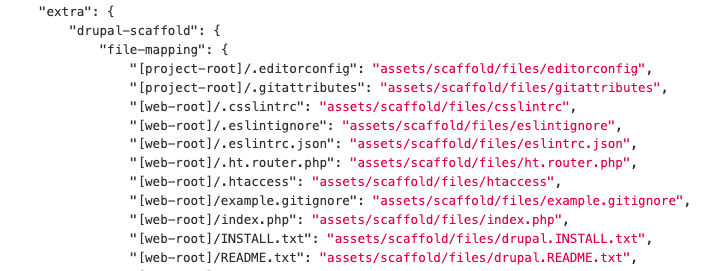

# Drupal / PHP Thangs

### Composer Installers

`composer/installers` - Useful when we want to install composer package in a specific location \( in framework like Drupal , Wordpress \)







### Scaffold \(drupal/core-composer-scaffold\) ^8.8.0

Different flavour of Drupal -&gt; Uses `drupal/core` -&gt; that provides core & Drupal scaffold assets \( i.e `index.php`, `.htacess`, `robot.txt` \)

Composer plugin that will automatically scaffold Drupal files.

#### Allowed Packages

Define `project/module/profile` that can scaffold - core by default.

```text
  "extra": {
    "drupal-scaffold": {
      "allowed-packages": [
        "drupal/core"
      ]
    }
```

```text
"locations": { "web-root" : "./docroot" } #define web-root location
```

#### Mapping scaffold files

Placement of scaffold assets is under the control of the project that provides them, but the location is always relative to some directory defined by the root project.



#### Alter scaffold files

Alter scaffold files by patching or appends additional data.

```text
  "extra": {
    "drupal-scaffold": {
      "file-mapping": {
        "[web-root]/robots.txt": {
          "append": "assets/my-robots-additions.txt",
        }
      }
    }
  }
```

Different hooks can be used to add patch

```text
  "scripts": {
    "post-drupal-scaffold-cmd": [
      "cd docroot && patch -p1 <../patches/htaccess-ssl.patch"
    ]
  }
```

_**Other feature : excluding, overwriting, symlink.**_




