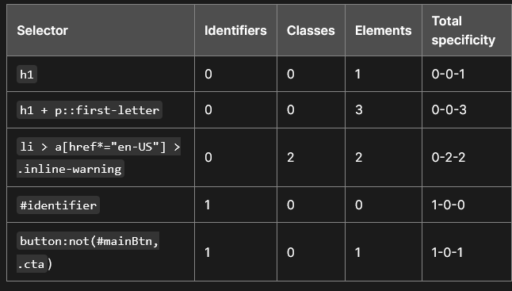

# CSS - Selector

### How CSS Cascade to apply specific rule to box model

* **Source order** - Same weight rule will use the later one
* **Specificity** - Higher specificity of selector is used (i.e ID > Classes)
* **Importance** - inline style & !important - given highest weight

### More in detail of how Specificity weight is calculated:

The amount of specificity a selector has is measured using three different values (or components), which can be thought of as ID, CLASS, and ELEMENT columns in the hundreds, tens, and ones place:

* **Identifiers**: Score one in this column for each ID selector contained inside the overall selector.
* **Classes**: Score one in this column for each class selector, attribute selector, or pseudo-class contained inside the overall selector.
* **Elements**: Score one in this column for each element selector or pseudo-element contained inside the overall selector.

<figure><figcaption>
Example of Specificity calculation
</figcaption></figure>

