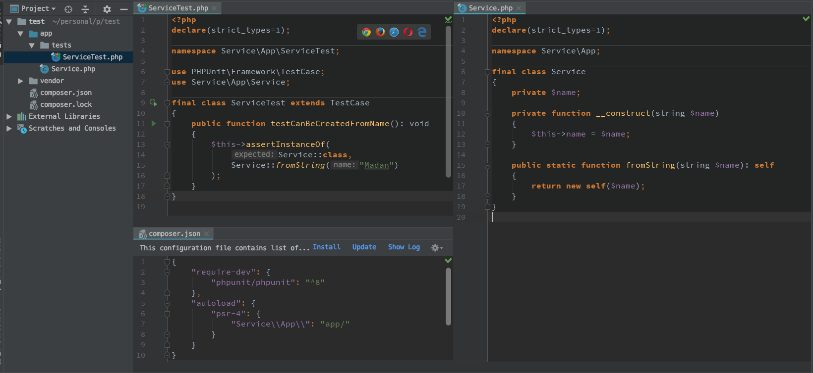

# PHPUnit Test

#### Intro

TDD \(Test Driven Development\) is one of the good practice habit to have when working on something for long term. 

As the saying goes:`Better test -> Knows if anything is broken -> More confident to refactor code -> Better program/code` 

The idea is simple, when we get a feature/function requirement. we first create a test for them and it should fail as we haven't implemented them yet. Then we implement the feature one by one and the test should pass as we start to implement the features. 

#### Basics

There are many test framework available for PHP and one of the most used one we will be using is PHPUnit. PHPUnit is used to create test for a small Unit of code. 

> A **unit** is the smallest testable part of any software.

#### Usual Steps

* Install PHPUnit in a project using composer 

  ```text
  composer require --dev phpunit/phpunit ^8
  ```

* Write a simple test for a function `app/tests/MyServiceTest.php`



* Run the test:
  * Using CMD `./vendor/bin/phpunit --bootstrap vendor/autoload.php app/tests/` 
    * Note any filename with prefix `*Test.php` will be tested
  * Using PHPStrom
    * Set PHP CLI Interpreter in `Preference>Lang>PHP` 
    * Set Test Framework in `Preference>Lang>PHP>Test Frameworks` 
    * Then Using the interface run the test
* The test should Fail then we can implement the code and make sure the test passes

#### Useful links:

[PHPUnit](https://phpunit.readthedocs.io/en/8.4/)


