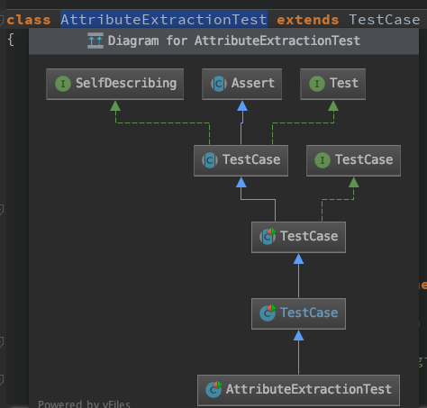
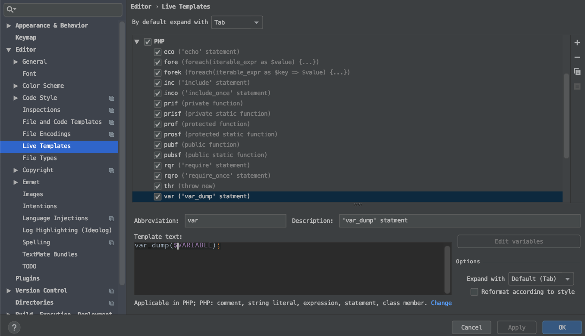
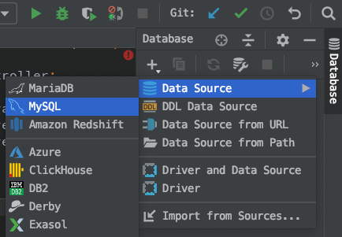

# PHPStrom

#### Useful short cut

* `Cmd + /` or `Cmd + Alt + /` - comment/uncomment 
* `Cmd + B` - Navigates to Declaration / Usage of a method
* `Cmd + Alt + B` - Navigates to Implementation of method
* `Cmd + R` - Search & Replace
* `Cmd + Atl + L` - Reformat code
* `Tab` or `Shift Tab` - Select & Tab to move selected code Right -&gt; or &lt;- Left
* `Cmd + E` - Show recent files
* `Ctrl + J` - Show documentation
* `Cmd + F12` - Get List of Methods available in a Class
* `Cmd + N` - Option to Auto Generate code

#### UML Class Diagram

PHPStrom has really nice feature to display selected class UML Diagram so we can see big picture of the class.

`Cmd + Alt + U` - Select the name of the class to show UML Diagram

#### Custom Templates

Within the list we can add our own common custom template with an Abbreviation that we use often in our code base. Then we can just use short Abbreviation to get the common template.

`Preference > Editor > Live Templates`  

#### Exclude directory

Some times we might want to exclude a directory from indexing or parsing like vendor \(composer\), modules \(npm\) or any mounted folder from docker. This would save PHPStrom from freezing when folder are being reindex. 

We can do this by `right clicking on folder` and marking directory as `Ecluded`

#### Useful Database tool

