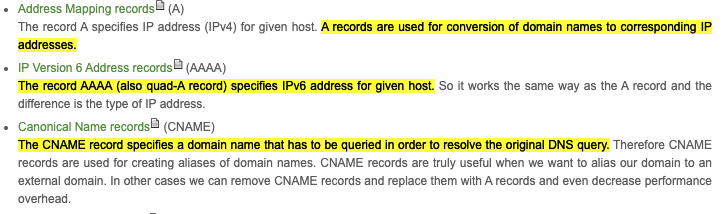

# Networking

{% embed url="http://dns-record-viewer.online-domain-tools.com/\#:~:text=A%20records%20are%20used%20for,names%20to%20corresponding%20IP%20addresses.&text=The%20record%20AAAA%20\(also%20quad,IPv6%20address%20for%20given%20host.&text=The%20CNAME%20record%20specifies%20a,resolve%20the%20original%20DNS%20query." %}

