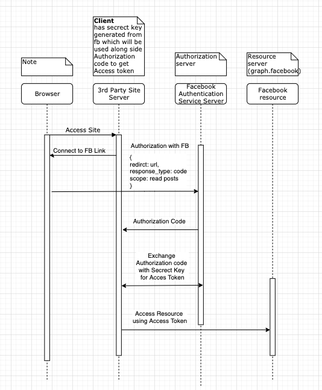

# OAuth 2.0

### Terminology

* **Resource owner** -&gt; User that owns the resource i.e facebook posts
* **Client** -&gt; 3rd party application that wants to access the resource  i.e Pinintreset
* **Authorization server** -&gt; Part service of resource holder for authorization i.e facebook
* **Resource server** -&gt; Where the actual resource are hold i.e graph.facebook
* **Authorization grant** -&gt; Authorizaton code to request token to access resources
* **Redirect URI** -&gt; Callback url after Authorization granted sucessfully
* **Access token** -&gt; Re-useable \(long or short term\) token to access the actual resource

### Communication Channels

**Front Channel** - Browser to Server

**Back Channel** - Server to Server channel \( 3rd Party side &lt;----&gt; Facebook Authentication or Resource server \)

### Generated variables from Authorization server

**Client ID** -  Used to identify the application and can be used in front channel

**Secrect Key** - Should be only kept in backend server as it is used along side Access token to access the resources and used in back channel

## Flavour of OAuth 2.0

### Authorization code \(front channel + back channel \)

 Uses secret key & Authorization code from Authenticator server to generate access token. 

### Front Channel only 

Sites with only frontend so no secrect key is used. Direct request to access token after authorization to front end. Initial request during authorization we would query for `response type: token` instead of `response type: code` which is used to get `Authorization code`. Less secure as access token is out in the open and any one can use it \( malicious extensions or network  \). 

### Client Credentials \( Backend to Backend server only \)





