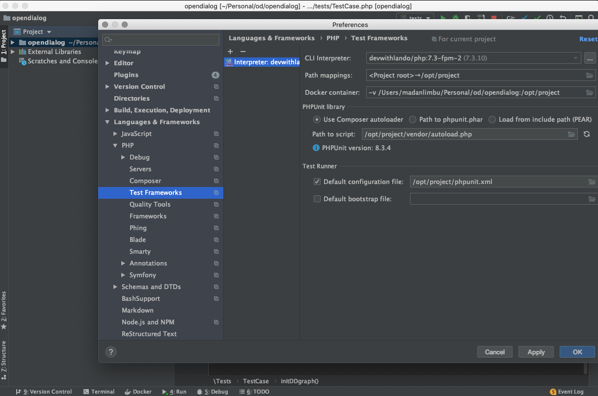
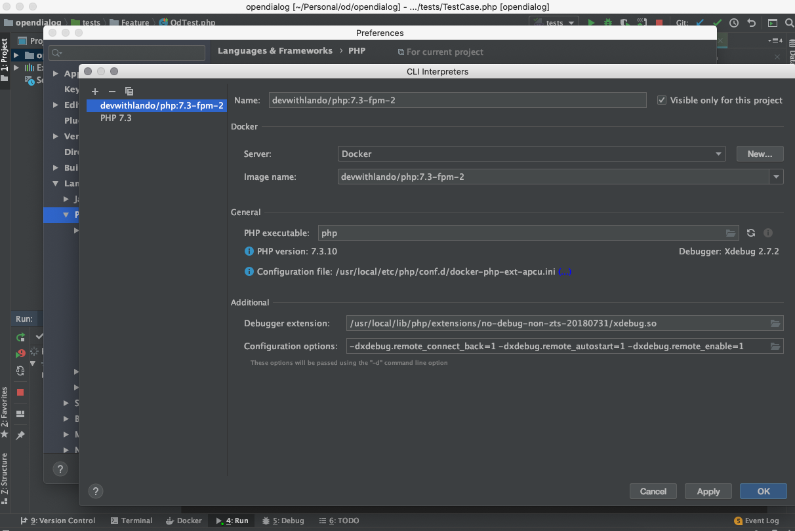

# Setups

#### Setting up locally&#x20;

* Clone opendialog locally`git clone git@github.com:opendialogai/opendialog.git`&#x20;
* Install [lando](https://docs.lando.dev/basics/installation.html)  `brew cask install lando` _Note: If docker is already installed, make sure to factory reset settings before installing lando_
* Run setup script `bash ./scripts/set_up_od.sh {appname}`  _Note: will be asked for input to reset/populate example data, Enter `yes` _&#x20;
* Once the script finishes running, visit [ https://{appname}.lndo.site/demo](https://opendialog.lndo.site/demo) where `{appname}` is the name we setup earlier, _Note: if `https` certificate is blocked from the browser & using http, Currently part of site resources will still point to https (e.g. `js` files) which will be blocked and fail the site from loading/functioning properly._

#### Basic lando

* Summary lando guide: [https://docs.lando.dev/basics/basics.html#ok-cool-i-dig-it-what-do-i-need-to-get-started](https://docs.lando.dev/basics/basics.html#ok-cool-i-dig-it-what-do-i-need-to-get-started)
* `lando sart/stop` to start/stop lando container from config file
* if lando configs are changed need to rebuild lando `lando rebuild`

#### Setting up PHPUnit test in PHPStrom

* In PHPStrom navigate to `Peference > Lang > PHP > Test Frame work`&#x20;
* Add a PHPUnit than add an interpreter
* Create new CLI Interpreter -> Select Docker Type (Remote Interpreter)
* Add new server docker for mac
* Pick the image that we created earlier `devwithlando/php:7.3-fpm-2`&#x20;
* In the field Debugger extension add path inside of docker image: `/usr/local/lib/php/extensions/no-debug-non-zts-20180731/xdebug.so`&#x20;
* Add config options for interpreter: `-dxdebug.remote_connect_back=1 -dxdebug.remote_autostart=1 -dxdebug.remote_enable=1`
* In Path to script field add: `/opt/project/vendor/autoload.php`&#x20;
* In Default config file field add: `/opt/project/phpunit.xml`&#x20;
* Edit configuration for PHPStrom Test and add the Interpreter we created above





#### Using local core / webchat modules

we have `composer-dev.json` which should always be kept up to date with `composer.json`.

To use local `opendialogai/core` or `opendialogai/webchat` we can clone these repo in same directory level as `opendialogai/opendialog` .

* `git clone git@github.com:opendialogai/opendialog.git opendialog`
* `git clone git@github.com:opendialogai/core.git opendialog-core`&#x20;
* `git cloen git@github.com:opendialogai/webchat opendialog-webchat`&#x20;

This should create follow directory structure:&#x20;

```
- opendialog
    - comopser-dev.json
- opendialog-core
- opendialog-webchat
```

To use local version of `core` or `webchat` we can let composer know we want to use `composer-dev.json` file by setting `COMPOSER` value.

`env COMPOSER=composer-dev.json composer install`&#x20;

`env COMPOSER=composer-dev.json composer update opendialogai/core`&#x20;

